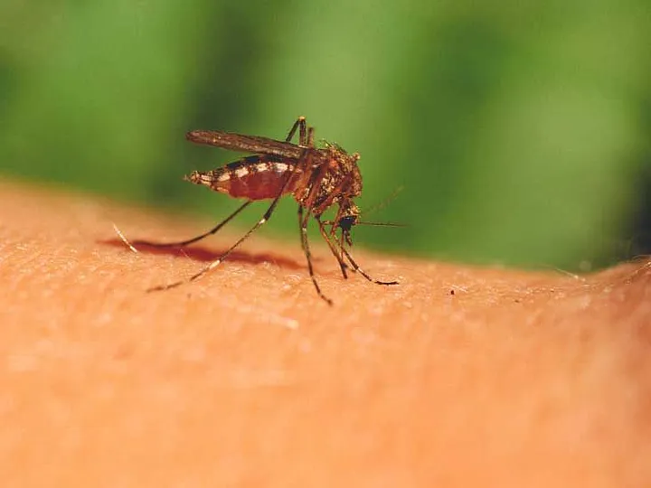

As warmer temperatures float through the northern hemisphere, people begin to spend more time outdoors, being one with nature and wildlife. Proximity to wildlife however, can give rise to many diseases, potentially causing outbreaks and public health concerns.

Zoonotic diseases refer to bacterial, viral, fungal and parasitic infections that spread between animals and human beings. Human beings can contract zoonotic diseases when they make contact with animals, either via work, recreation, consumption or the environment. Humans may easily suffer insect bites, consume infected meat, or touch contaminated surfaces and fluids as part of their everyday lives. Zoonotic diseases such as Lyme Disease, West Nile Virus, Rabies, Salmonellosis or Ringworm may sound familiar to some individuals.

*Retrieved from: https://www.healthline.com/health/mosquito-bites*

Zoonoses and biological agents account for about 60% of all infectious diseases known to impact humans today. Medical treatment can help manage most of these diseases in the US, however, scientists estimate that around 75% of emerging diseases may also originate from animals. On a global scale, zoonotic diseases currently cause 2.5 billion illnesses and 2.7 million fatalities every year.

Existing zoonotic diseases can trigger various symptoms, including fever, skin inflammation, gastrointestinal disorders, and abnormal behavior. Some severe or untreated cases may even lead to death. High-risk individuals include seniors over 65, children under 5, pregnant women, and people with weakened immune systems.

## Types of Zoonotic Diseases ##

Zoonoses can be classified according to their etiological or causal agent. Zoonotic agents include various types of pathogens, including bacteria, viruses, parasites, and fungi. Let’s take a look at some zoonotic diseases that have the potential to affect human beings in North America.

### Bacterial Zoonoses ###

Some bacterial zoonoses could include Lyme Disease, Brucellosis and Salmonellosis. Caused by the _Borrelia burgdorferi_ bacterium, Lyme Disease affects humans through tick bites, potentially impacting around 450,000 people in the United States annually. Pets can also carry this disease if bitten by infected ticks. Symptoms include fever, nervous system issues, and “bulls-eye” looking skin rashes.

*Retrieved from: [https://www.hyperthermia-centre-hannover.com/lyme-disease-borreliosis](https://www.hyperthermia-centre-hannover.com/lyme-disease-borreliosis)*

Transmitted through cattle, sheep, goats and pigs, Brucellosis may normally affect farmers, veterinary personnel or people who work in meat processing. The _Brucella_ bacterium may cause fever, fatigue, headache and muscle pain. Brucellosis is relatively uncommon in the United States, with about 80 to 140 cases being reported every year.

The _Salmonella_ bacteria lives in the intestines of many animals such as birds, reptiles, pigs and cows. Human beings contract Salmonellosis when they consume infected meat or work in food handling and meat processing. Symptoms include diarrhea, fever, and other gastrointestinal issues. Salmonella leads to 1.35 million infections, 26,500 hospitalizations, and 420 deaths in the United States every year.

### Viral Zoonoses ###

Human beings can also acquire viral infections from different animals. For example, mosquitos play host to many viruses including the West Nile Virus, Zika Virus, and Dengue. Dogs, bats, raccoons and deer may also carry the well-known Rabies virus, while birds may spread avian influenza or bird flu.

The West Nile Virus affects around 2,205 Americans on a yearly basis. Many individuals may be asymptomatic when contracting this virus, however those who have symptoms may experience fevers and flu-like symptoms.

Zika on the other hand, is far less prevalent in the United States, with reported cases significantly declining in the last ten years. Cases continue to climb in other parts of the world however, leading to fevers, rashes and muscle pain. Zika also elicits severe symptoms in pregnant women, increasing the chances of stillbirths, birth defects, premature births and many other developmental issues in babies.

Avian influenza or bird flu largely infects birds but may also impact human beings if they handle wild birds and poultry. The Rabies virus, though very rare in the United States, infects the central nervous system, causing brain diseases and death. Early symptoms include fevers and headaches which gradually progress to insomnia, anxiety, paralysis and hallucinations. Death usually occurs within days of symptom onset.

### Parasitic Zoonoses ###

Parasites normally require a living host to survive. Parasites may invade plants, animals and human beings through water, soil, food, or waste. Human beings and animals typically contract parasitic infections through insect bites or contaminated food and water. Once inside the host, parasites can alter bodily functions, modify behavior, and cause gastrointestinal disorder.

Giardiasis, a common parasitic infection, affects intestines and causes diarrhea, stomach cramps and nausea. The Giardia parasite can survive for weeks in streams and backwaters, sometimes making its way to drinking water supply. The CDC estimates that Giardiasis affects over 1 million people in the United States.

*The giardia parasite. Retrieved from: [https://www.cdc.gov/giardia/about/index.html](https://www.cdc.gov/giardia/about/index.html)*

Malaria is another, more well-known parasitic infection transmitted by mosquitos. Symptoms include chills, a high fever, confusion and a faster heart rate. Although not common in the United States, about 2000 diagnoses occur in the country every year, mainly due to international travel. Last year however, the United States recorded their first few local cases of Malaria after 20 years.

### Fungal Zoonoses ###

Humans typically contract fungal infections from breathing in spores within dust and soil or making direct contact with animals and contaminated surfaces.

Ringworm is a contagious fungal infection caused by _dermatophytes_ and  characterized by scaly, itchy, and circular skin rashes. They may appear reddish on lighter skin or blackish on deeper skin. Animals such as dogs, cats, cattle or rodents can all carry ringworm and pass the pathogen onto human beings.

## An introduction to Zoonotic Disease Ecology ##

Disease ecology studies how pathogens interact with their hosts and their environment. This sub-field of ecology examines how pathogens, such as viruses and bacteria, colonize their hosts and how environmental changes affect the host-pathogen relationship. When it comes to zoonoses, disease ecology focuses on the transmission, invasion and interactions of pathogens between animals and human beings.

*Retrieved from: [https://umaine.edu/news/blog/2017/09/14/elias-hajek-team-capture-complete-picture-ticks-lyme-disease-progression/](https://umaine.edu/news/blog/2017/09/14/elias-hajek-team-capture-complete-picture-ticks-lyme-disease-progression/)*

Disease ecology provides major insights into the survival tactics of various pathogens. Understanding pathogen behavior will help analyze the emergence and spread of disease along with determining appropriate controls to promote public health.

Every biological organism requires energy to grow, reproduce and maintain their populations. The physical environment provides energy in the form of light and food to cement the survival of various plants and animals. Similarly, pathogens derive energy from their hosts. Once the host dies, the pathogen can die with them. In order for their population to survive, pathogens begin to invade new hosts and build colonies across multiple environments. New hosts and environments may enable pathogens to evolve and adapt over time.

Although the pathogens may gain a significant advantage from invading multiple hosts, they may also evolve to become more harmful and end up killing their hosts too quickly. Since pathogens need their hosts to remain alive for transmission, they must balance the trade-off between rapidly spreading and not becoming overly harmful.

Pathogens spread depending on various factors, including the characteristics and behavior of the pathogen itself, the animal that serves as a host, the vector that carries the pathogen, and the pathways through which the pathogen reaches and infects human populations. A “vector” refers to any organism or animal that carries and transmits disease.

When trying to estimate the risk of zoonotic diseases, one must identify the main hosts, vectors, and ideal reservoirs for each pathogen. A “reservoir” refers to the natural habitat that promotes a pathogen’s survival, growth and multiplication. The behaviors, bodily functions, and population abundance of these animals can help predict the transmission of a particular pathogen. Once the pathogen reaches the human population, health risks also depend on the probability and severity of the disease after infection.

Pathogens require particular types of host environments to survive and breed. For example, the gastrointestinal tract provides an excellent habitat for many parasites due to the incoming food and nutrients. Certain environmental conditions and habitat disruptions can also alter their invasion and transmission patterns. A higher number of host populations also provide multiple habitats for the pathogens to invade, incubate and reproduce.

Anthropogenic activities and environmental changes play a large role in dictating the behavior of pathogens and vectors. For instance, construction, mining, logging and other activities can remove trees, disturb the soil, and introduce pollutants into various habitats. Several animals become displaced and move to other areas, leading to habitat fragmentation. Habitat fragmentation may also occur through natural disasters, such as wildfires or hurricanes. As the displaced animals migrate, they carry pathogens to different areas, giving these pathogens the opportunity to invade different hosts across different geographic locations.

*Animals move from one habitat to the next due to habitat fragmentation. As they migrate, their pathogens migrate with them. Ticks and other vectors feed on these animals in a wider variety of locations, thus being able to transmit diseases to a larger number of susceptible animals or people. Retrieved from: https://earth.org/how-does-habitat-fragmentation-affect-biodiversity/*

Environmental changes such as increased temperatures and high levels of precipitation can also promote the growth or migration of different hosts and vectors such as mosquitos and rodents. A higher number of hosts increases the amount of transmission.

The above information can be explained using the example of Lyme Disease. The Borrelia burgdorferi bacteria finds its ideal reservoirs in birds, mice and deer. As predators prey upon these animals, they too can contract this bacteria and become a host. All of these host animals migrate to various locations, due to changes in the temperature, precipitation, food availability, and habitat. Ticks, being the vector, may bite these animals or feed on their carcasses after they die. The Borrelia burgdorferi bacteria then invades the tick, which becomes a carrier or vector. When the ticks bite other animals and human beings, they transmit the bacteria and promote its spread.

*Birds with tick bites carry the Borrelia bacteria to different locations. Retrieved from: [https://www.mainepublic.org/environment-and-outdoors/2017-07-03/in-the-battle-against-ticks-and-lyme-disease-scientists-look-to-the-skies](https://www.mainepublic.org/environment-and-outdoors/2017-07-03/in-the-battle-against-ticks-and-lyme-disease-scientists-look-to-the-skies)*

As the Borrelia bacteria makes itself at home, the infected human being first develops rashes at the point of contact, followed by flu-like symptoms, body pain and muscle weakness. Humans have a higher chance of suffering tick bites near forested and residential areas.

In terms of environmental changes, studies have seen positive correlations between tick abundance and habitat fragmentation and increased precipitation.

The transmission of the _Borrelia burgdorferi_ bacteria thus depends on the number of host animals and vectors, their behavior, their reproductive patterns, and environmental conditions. Disease incidence in the human population also depends on human behavior and their proximity to forested areas.

## Ecological Controls ##

Zoonotic disease controls remain limited and may present several drawbacks. Ecological interventions may prevent transmission at the source, path, receiver level or a combination of all three.

Stopping transmission along the source or path may incorporate some form of vector or host population control. For example, lowering the number of mosquitos or ticks could also reduce the number of pathogens being transported to various animals and human beings. However, purposely culling populations can have negative effects on the ecosystem. Introducing natural predators and competitors may also help control the populations of hosts and vectors. If predators feed on host animals, they reduce the number of habitats for pathogens to invade. Competitors would also help control host populations by seeking out the same food and resources. When introducing organisms into new environments, one must be careful about invasive species.

Limiting contact between animals and human beings can also help reduce transmission along the path. Animals and vectors may change their behavior depending on the availability of food for instance. Conserving their habitat would provide them with more food and shelter, potentially altering their movements and reducing contact with human beings.

*If animals have [enough food to eat in their habitats, they may not feel](https://www.mpg.de/13271542/fruit-bats-seed-dispersal) the need to migrate and may not spread diseases to other locations. Retrieved from: https://www.mpg.de/13271542/fruit-bats-seed-dispersal*

Finally, vaccinating hosts and humans can also lead to positive outcomes and curb the reproduction of pathogens. Vaccines reduce the number of individuals vulnerable to infection. Every single individual need not get vaccinated to slow the spread of infection. By vaccinating enough individuals, the population can achieve herd immunity, where immune beings block transmission to others and curb the spread of infection.

The SIR model is a fundamental epidemiological concept that explains how a disease spreads within a population. The model categorizes individuals in a host population into three major compartments: Susceptible (S), Infected (I), and Recovered (R). Individuals move between these compartments as susceptible individuals become infected, and infected individuals either recover or die.

The SIR model claims that the spread of the disease is influenced by several factors, including the density of susceptible and infected individuals, the likelihood of interactions between them, how effectively the disease spreads (or the “transmission coefficient”), and the mortality or recovery rate of infected individuals. However, the most prominent influencer of disease transmission depends on the number of susceptible individuals. The SIR model states that a disease will only spread if the number of susceptible individuals exceeds a “critical threshold density”. This threshold describes the minimum number of susceptible individuals needed for a disease to establish and propagate. If the density of susceptible individuals is above this threshold, the disease can spread through a population.

Vaccination will curtail the number of susceptible individuals in a population. Early detection programs and improved treatment can increase the recovery rate of individuals. Quarantining and changing behaviors reduces the transmission coefficient of a disease.

*Swabbing a fruit bat for detecting disease. Retrieved from: [https://www.newscientist.com/article/2356566-fruit-bats-get-swabbed-to-look-for-diseases-that-could-jump-to-humans/](https://www.newscientist.com/article/2356566-fruit-bats-get-swabbed-to-look-for-diseases-that-could-jump-to-humans/)*

## Conclusion ##

Zoonotic diseases pose a significant threat to public health, with the potential to cause widespread illness and fatalities. Understanding the ecology of zoonotic diseases is critical for developing effective strategies to control their impact on human populations. By focusing on ecological controls, such as managing vector and host populations, conserving natural habitats, and implementing vaccination programs, we can reduce the transmission of these diseases and protect susceptible communities.

However, like all other public health strategies, ecological controls also pose various challenges. Scientists must consider management programs that effectively curtail the spread of zoonotic disease while avoiding the disruption of the ecosystem and the environment. Lastly, public education will help increase awareness and knowledge when it comes to detecting disease, building effective vaccination programs, and changing overall human behavior to reduce the risk of zoonotic disease transmission.

## References ##

- Assistant Secretary for Health (ASH). (2023, August 2). _West Nile Virus and Other Mosquito-borne diseases_. Hhs.gov; US Department of Health and Human Services. [https://www.hhs.gov/climate-change-health-equity-environmental-justice/climate-change-health-equity/climate-health-outlook/west-nile/index.html](https://www.hhs.gov/climate-change-health-equity-environmental-justice/climate-change-health-equity/climate-health-outlook/west-nile/index.html)

- Brucellosis, W. is. (n.d.). _Brucellosis(Undulant fever, Mediterranean fever)_. Cdph.ca.gov. Retrieved July 16, 2024, from [https://www.cdph.ca.gov/Programs/CID/DCDC/CDPH%20Document%20Library/BrucellosisFactSheet.pdf](https://www.cdph.ca.gov/Programs/CID/DCDC/CDPH%20Document%20Library/BrucellosisFactSheet.pdf)

- CDC. (2024, May 20). _Lyme disease surveillance and data_. Lyme Disease. [https://www.cdc.gov/lyme/data-research/facts-stats/index.html](https://www.cdc.gov/lyme/data-research/facts-stats/index.html)

- Filippelli, G. (n.d.). _Zoonotic diseases_. Environmental Resilience Institute. Retrieved July 15, 2024, from [https://eri.iu.edu/tools-and-resources/fact-sheets/zoonotic-diseases.html](https://eri.iu.edu/tools-and-resources/fact-sheets/zoonotic-diseases.html)

- Kilpatrick, A. M., Dobson, A. D. M., Levi, T., Salkeld, D. J., Swei, A., Ginsberg, H. S., Kjemtrup, A., Padgett, K. A., Jensen, P. M., Fish, D., Ogden, N. H., & Diuk-Wasser, M. A. (2017). Lyme disease ecology in a changing world: consensus, uncertainty and critical gaps for improving control. _Philosophical Transactions of the Royal Society of London. Series B, Biological Sciences_, _372_(1722), 20160117. [https://doi.org/10.1098/rstb.2016.0117](https://doi.org/10.1098/rstb.2016.0117)

- Rahman, M. T., Sobur, M. A., Islam, M. S., Ievy, S., Hossain, M. J., El Zowalaty, M. E., Rahman, A. T., & Ashour, H. M. (2020). Zoonotic diseases: Etiology, impact, and control. _Microorganisms_, _8_(9), 1405. [https://doi.org/10.3390/microorganisms8091405](https://doi.org/10.3390/microorganisms8091405)

- _Salmonella homepage_. (2024, June 18). Cdc.gov. [https://www.cdc.gov/salmonella/index.html](https://www.cdc.gov/salmonella/index.html)

- _Zoonotic disease threats in the U.s. uncovered in comprehensive new report_. (n.d.). Harvard Law School — ALPP. Retrieved July 15, 2024, from [https://animal.law.harvard.edu/news-article/animal-markets-and-zoonotic-disease/](https://animal.law.harvard.edu/news-article/animal-markets-and-zoonotic-disease/)
